# dataviz

Various visualizations. Nothing more.

# Arctinet 2019 ASM

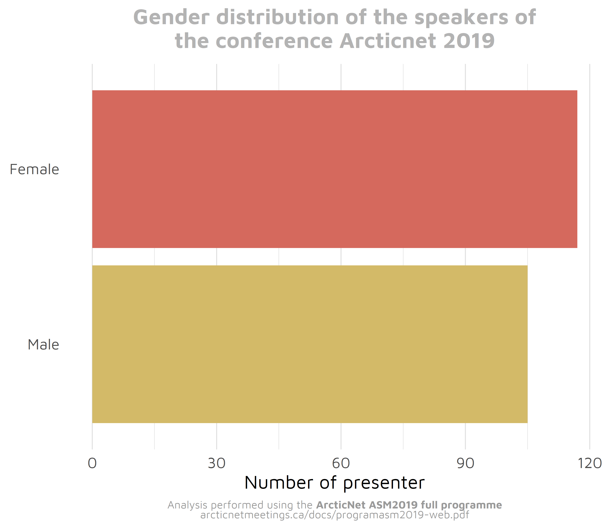

# Sentinel North 2019 meeting

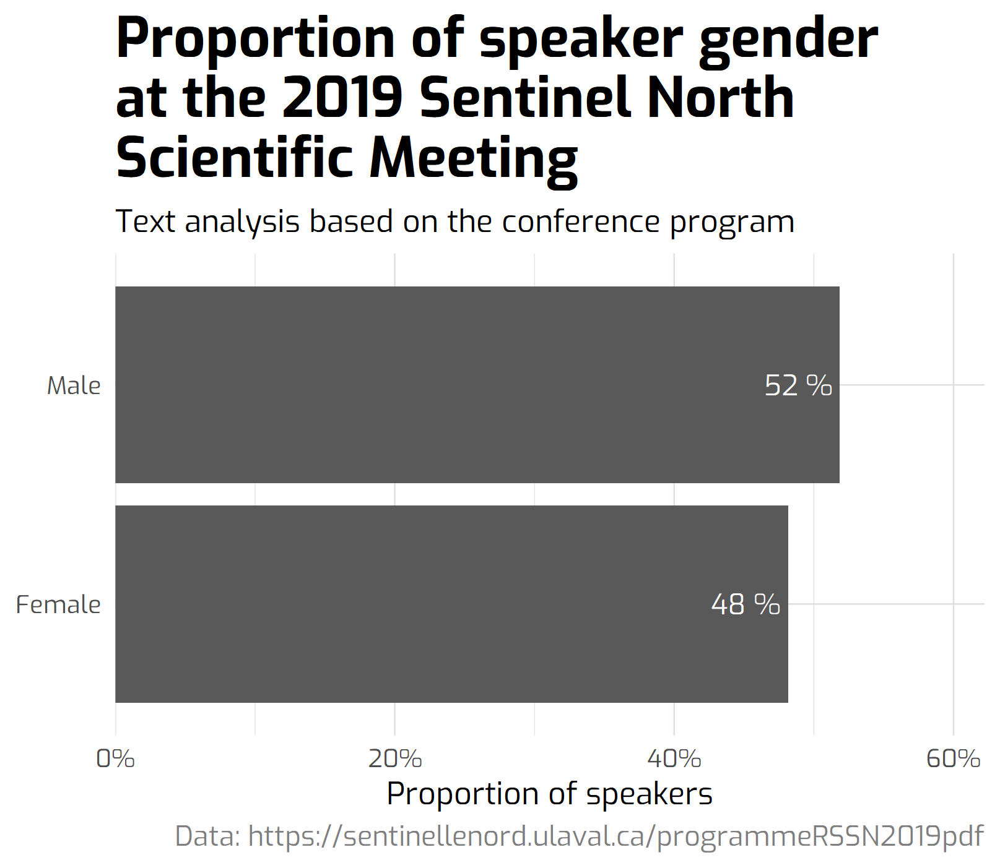

# 2009 vs 2019: decrease of Arctic sea ice extent

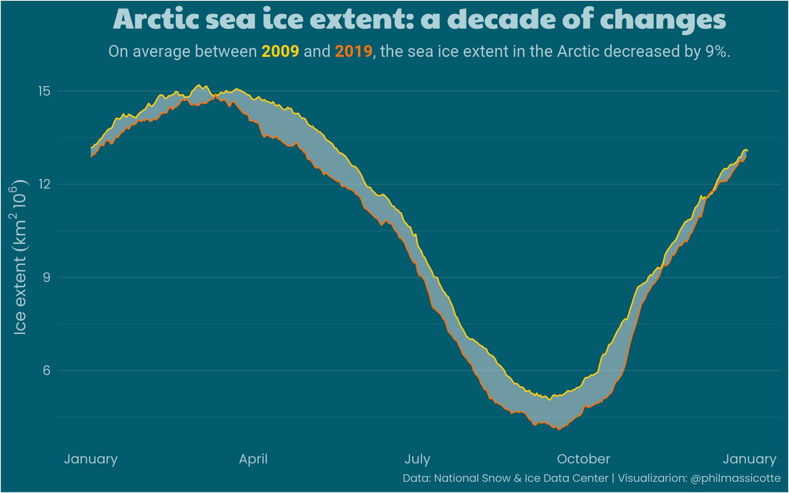

# Impractical jokers biggest losers

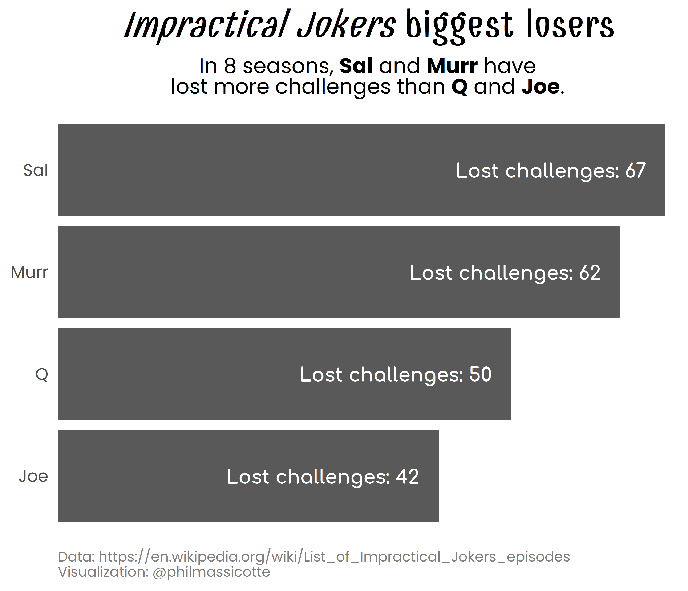

# covid-19 au Québec

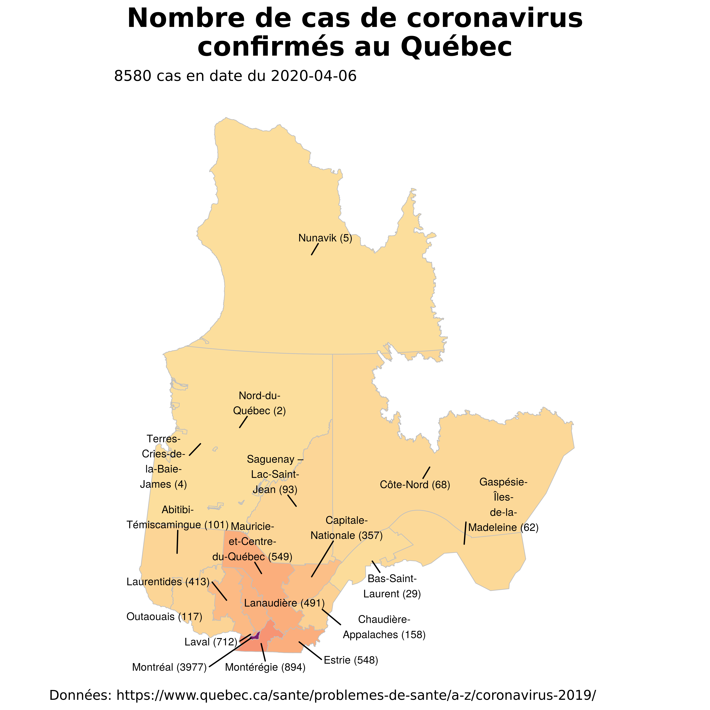

# covid-19 novel cases

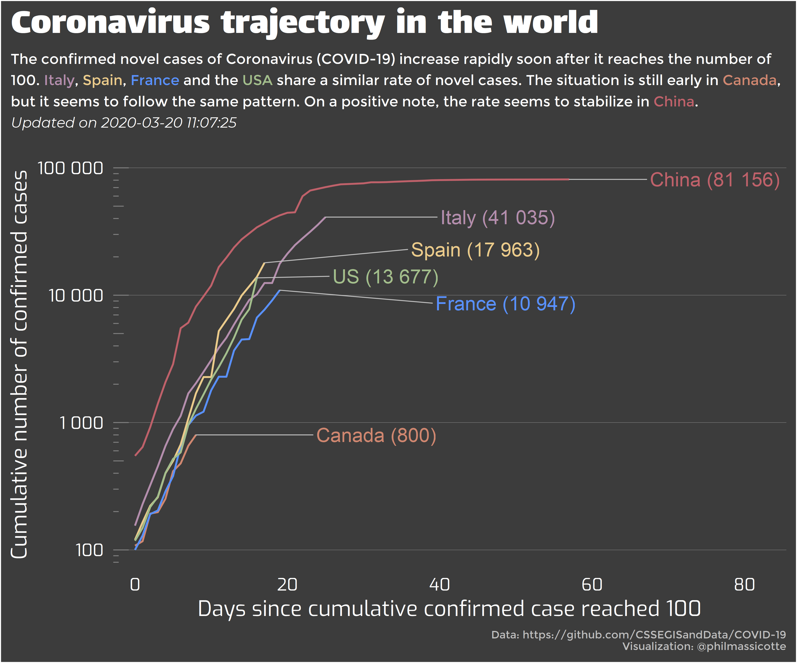

# ggplot2 downloads

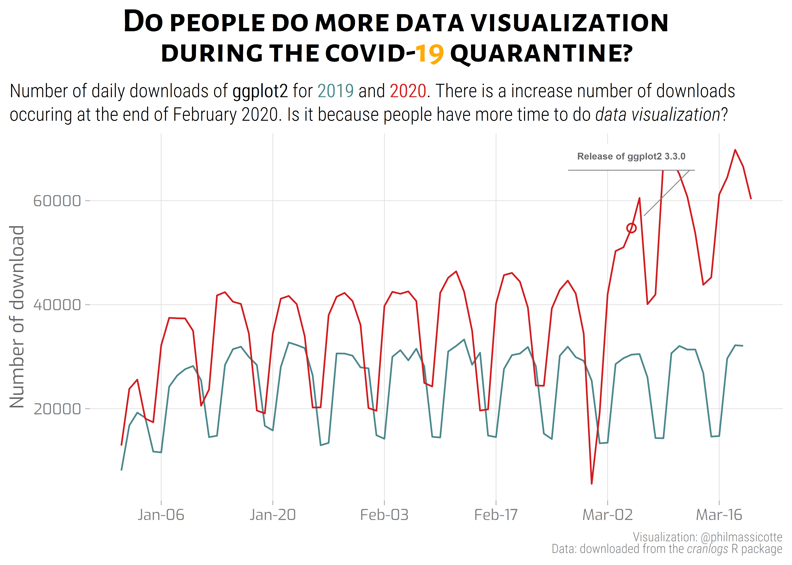

# covid-19 in the USA

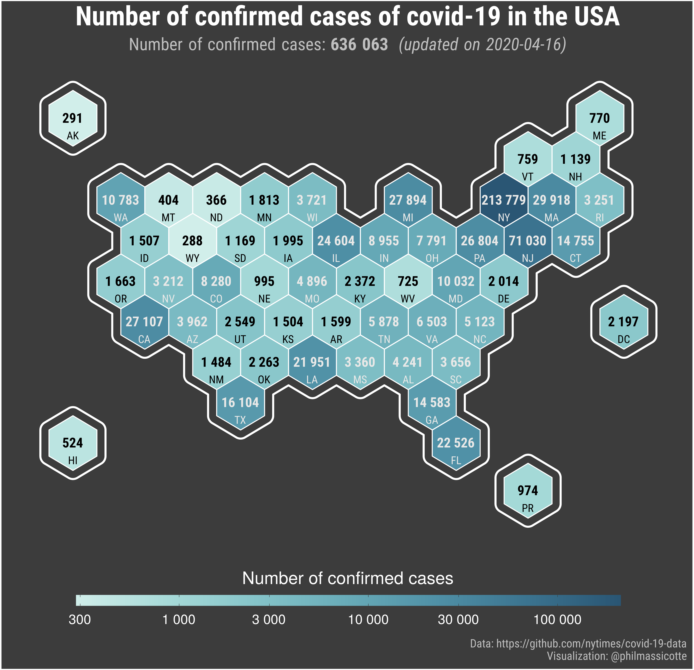

# covid-19 daily cases in Canada

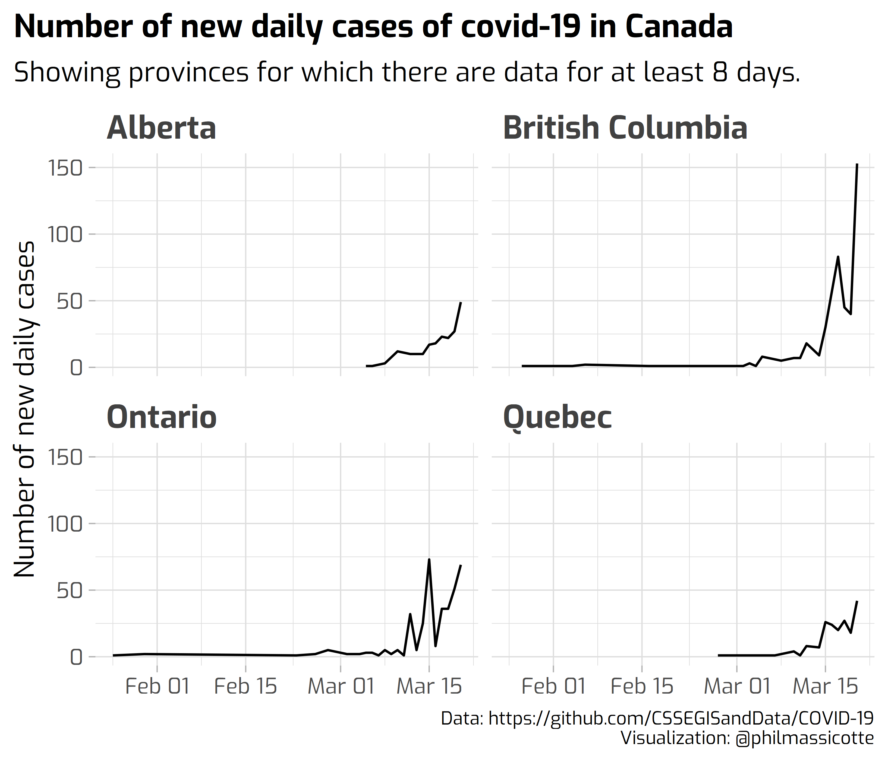

# covid-19 Mobility

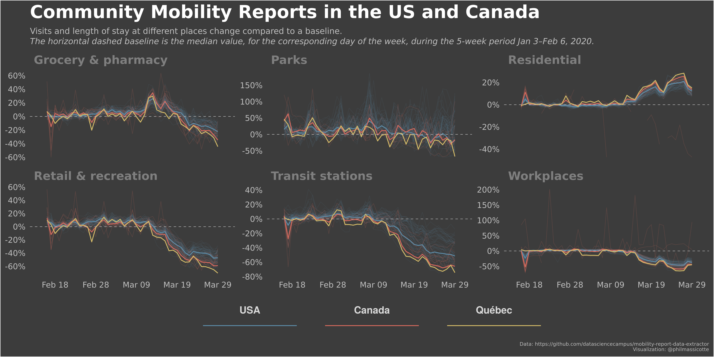

# covid-19 in USA counties

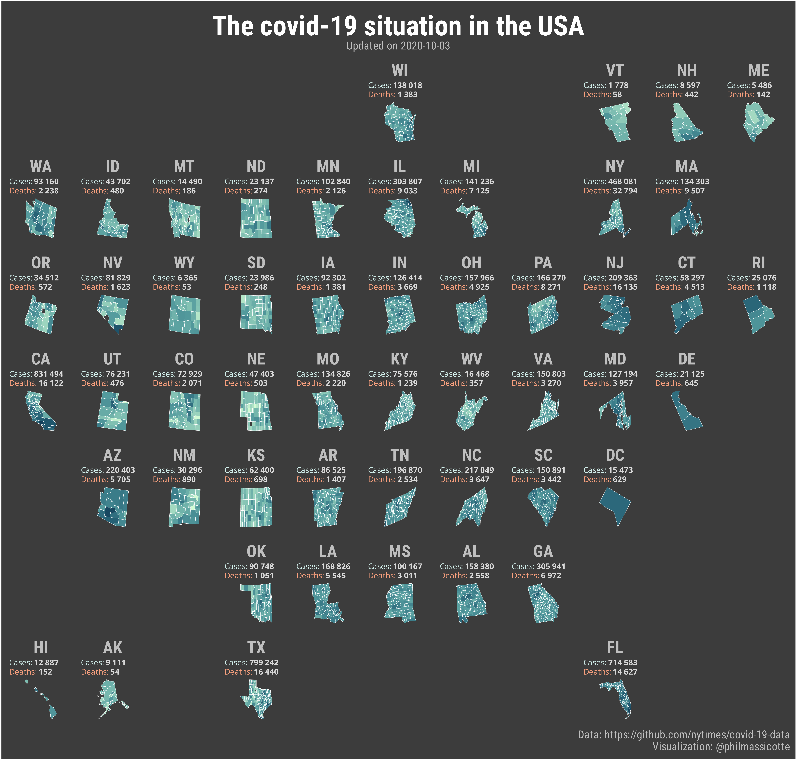

# covid-19 deaths by country

