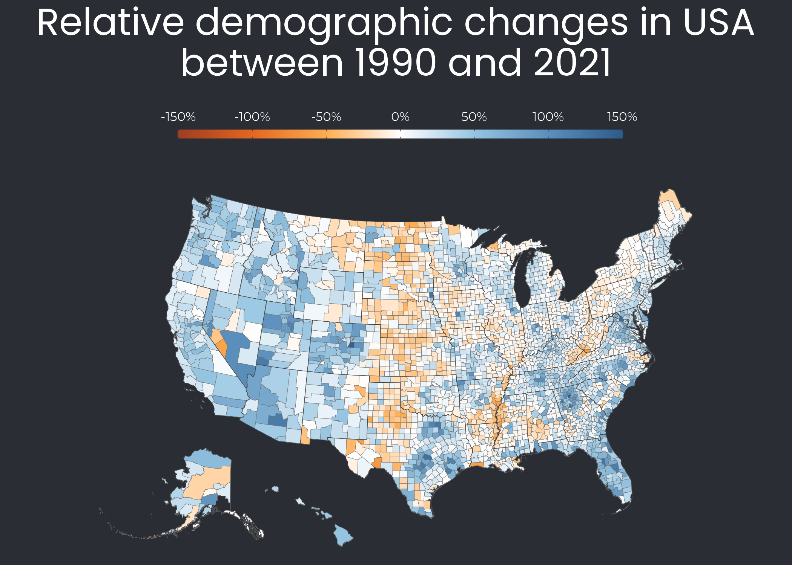
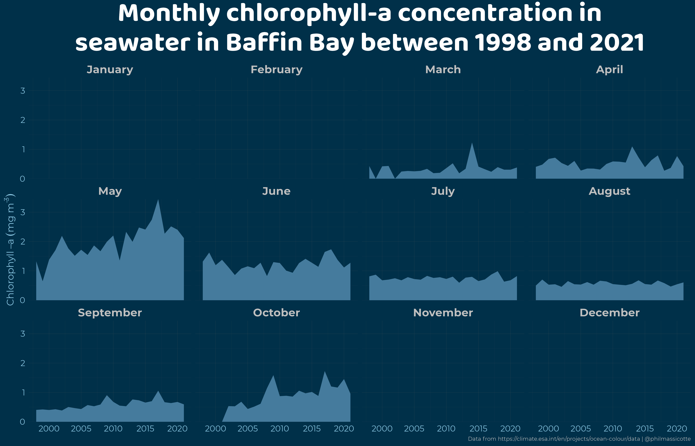
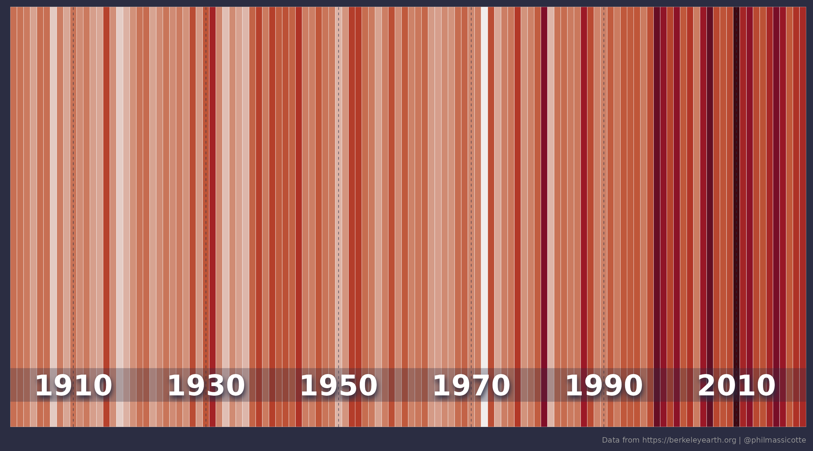
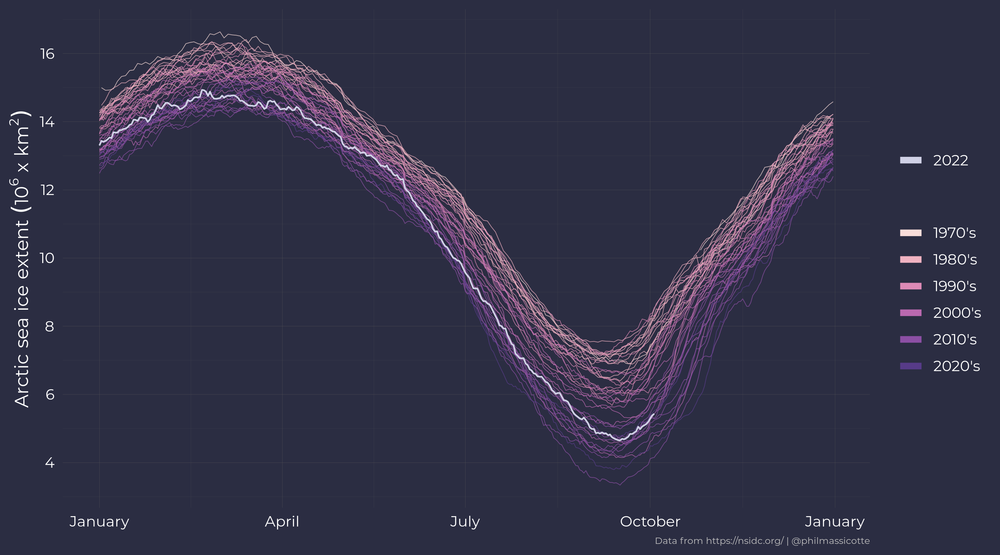

# Various visualizations. Nothing more. Nothing less.

## Construction permits in San Francisco

## 

## Demographic change in USA

## 

## Chlorophyll-a concentration in Baffin Bay

## 

## Drought severity in USA

## Show your stripes

[Showyourstripes](https://showyourstripes.info/) says:

> These ‘warming stripe’ graphics are visual representations of the change in temperature as measured in each country over the past 100+ years. Each stripe or bar represents the temperature in that country averaged over a year. For most countries, the stripes start in the year 1901 and finish in 2021. For the ocean basins and for several countries with longer datasets available the stripes start in the 19th century instead. For two cities (Stockholm and Vienna), the data starts in the 18th century.

## Sea ice concentration in Baffin Bay

## Arctic sea ice extent

